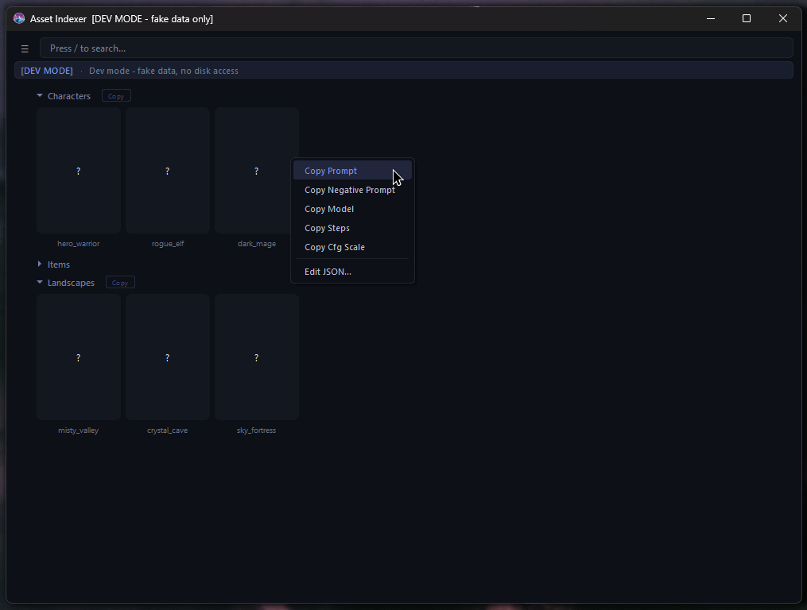

# Asset-Indexer

A desktop application for browsing, searching, and editing structured data paired with visual assets, organized into a fast and intuitive interface, with native support for Windows and Linux.



---

## Table of Contents

- [Overview](#overview)  
- [Features](#features)  
- [Getting Started](#getting-started)  
  - [Installation](#installation)  
  - [Uninstall](#uninstall)  
- [Usage](#usage)  
- [Contribution Guidelines](#contribution-guidelines)  
- [Contact](#contact)  
- [License](#license)

---

## Overview

Asset Indexer is a desktop application that scans folders of image + JSON pairs and turns them into a searchable, visual data library. It allows you to quickly find, preview, copy, and edit structured data in an organized way.
It features native support for Windows and Linux, with partial Wayland support.

---

## Features

* 🗂️ **Folder-based indexing**: Automatically scans directories for `.png` + `.json` pairs and builds a structured database.  
* 🔍 **Instant search**: Quickly find prompts by name across all indexed assets.  
* 🖼️ **Thumbnail previews**: Visual grid layout for easy browsing of assets.  
* 📋 **One-click copy**: Copy prompt fields (like prompt, negative prompt, etc.) directly from the UI.  
* ✏️ **Inline JSON editing**: Edit associated JSON files directly within the app.  
* 🧩 **Folder metadata tags**: Use special `!F-<folder>.json` files to define reusable prompt snippets.  
* 🗃️ **Multiple databases**: Manage and switch between different indexed folders.  
* ⚡ **Startup scripts**: Run custom Python scripts automatically on app launch.  
* 🧪 **Dev mode**: Launch with `--dev` to test the app using a safe in-memory dataset.  

---

## Getting Started

### Installation

1. Clone the repository:
   ```bash
   git clone https://github.com/yourusername/prompt-indexer.git
   cd prompt-indexer
   ```

2. Start the app using the provided script (recommended):

   - **Windows**:
     ```bash
     start.bat
     ```

   - **Linux / macOS**:
     ```bash
     chmod +x start.sh
     ./start.sh
     ```

   This will automatically:
   - Create a virtual environment  
   - Install all dependencies  
   - Launch the application  

---

#### Manual setup (optional)

If you prefer to set things up manually:

1. Install dependencies:
   ```bash
   pip install PySide6
   ```

2. Run the application:
   ```bash
   python app.py
   ```


---

### Uninstall

To fully remove the application:

1. Delete the project folder.

2. Remove application data stored on your system:
   - **Linux / macOS**:  
     ~/.prompt_indexer/
   - **Windows**:  
     C:\Users\<YourUser>\.prompt_indexer\

This directory contains:
- Indexed databases (`.db` files)  
- Preferences (`prefs.json`)  
- Startup scripts config (`startup_scripts.json`)  

---

## Usage

1. **Add a folder**  
   - Open the app and select a folder containing `.png` images with matching `.json` files.

2. **Index assets**  
   - The app scans and builds a database automatically.

3. **Browse & search**  
   - Use the search bar to filter assets by name.  
   - Expand folders to explore structured results.

4. **Interact with assets**  
   - Click a card to view details.  
   - Right-click to copy prompt fields.  
   - Open the JSON editor to modify data.

5. **Use folder tags**  
   - Add a file like `!F-MyFolder.json` to define reusable prompt snippets.

6. **Manage databases**  
   - Switch or remove indexed folders via the database dialog.

💡 **Tip:**  
To safely test the app without modifying real data, launch it in dev mode:
```bash
python app.py --dev
```

---

## Contribution Guidelines

Your contributions are welcome!

[Conventional Commits](https://www.conventionalcommits.org/)

---

## Contact

* **Maintainer**: Ventexx ([enquiry.kimventex@outlook.com](mailto:enquiry.kimventex@outlook.com))

---

## License

This work is licensed under a  
[Creative Commons Attribution-NonCommercial 4.0 International License](LICENSE).

You may use, modify, and share this software for non-commercial purposes, provided that appropriate credit is given.

Disclaimer: This software is provided "as is", without warranty of any kind. The author is not liable for any damages or issues arising from its use.
